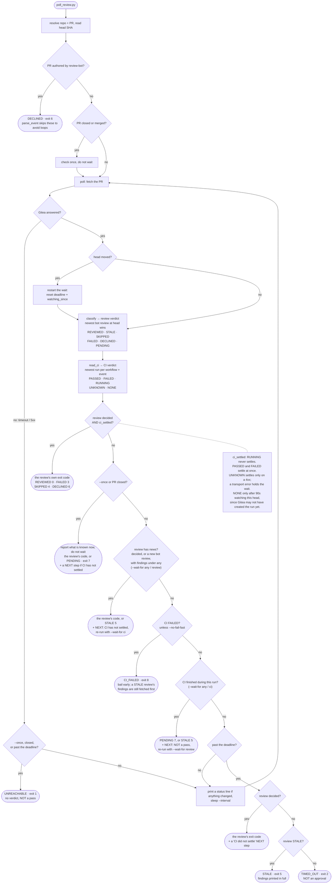

# babysit-pr

A Claude Code skill. Waits for `review-bot` (the `gitea-review-agent` companion
project) to review a PR on your Gitea instance and for that PR's CI to reach a
final state. It returns as soon as **either** has news, reports what each
found, and says how to wait for the one still open.

It exists because the bot cannot block a merge: `build_review_payload`
hardcodes `"event": "COMMENT"`, never `APPROVE` or `REQUEST_CHANGES`, so branch
protection has nothing to gate on. A review can take ~30 minutes and routinely
lands after a fast merge. This skill is the only thing that makes you wait.

`SKILL.md` is what the model reads when the skill triggers, and it is kept
short on purpose. The verdict and CI tables are in `references/verdicts.md`,
flags and environment in `references/setup.md`, and the reply/resolve
contract in `references/replying.md`, each read only when needed.
`HISTORY.md` has the incidents behind each rule.

## The flow

The review and CI are two independent verdicts. One loop polls both, and
neither waits on the other. By default (`--wait-for any`) the loop returns on
whichever side has news first, so the reader can act on a finding while CI is
still running, or fix a red CI before the review lands. `--wait-for review`,
`ci` or `both` narrow that; `both` is the old "return only once both settled".



Six things this shape depends on:

- **Control comes back on the first news, not the last.** Waiting for both
  sides held a bot failure posted at 32s until CI finished at 2184s. Each early
  return names the one command that waits for the side still open. A CI that
  had already passed when the run began, a STALE review that was already
  there, and a review with no findings are not news: returning on them would
  send the reader straight back.
- **Once the review decides, the code is the review's.** CI gets its own
  block. `PASSED` CI next to a `FAILED` review is still exit 3, and a failed
  CI next to a `REVIEWED` is still 0, so read both blocks, not the number.
- **`TIMED_OUT` is the last branch, not the default.** The decline paths now
  report as `DECLINED` with a reason, and a Gitea outage reports as
  `UNREACHABLE`. Reaching `TIMED_OUT` means none of them applied.
- **"Could not look" is never "nothing there".** An unreadable Actions API is
  `UNKNOWN`, not `NONE`. A Gitea that stays down is `UNREACHABLE`, not
  `TIMED_OUT`.
- **Every code means one thing.** Stopping early has codes of its own:
  `PENDING` (7) when the run returned before the review said anything,
  `CI_FAILED` (8) when CI failed before the review decided. They used to borrow 2 and 5, so exit 2 could
  mean `TIMED_OUT`, "did not wait" or "CI failed first".
- **The output says what to do next.** Every exit path ends with a `>> NEXT:`
  block written for that result: verify these findings, fix CI first, this
  is not a pass. The reader follows the step in front of it instead of
  keeping a table of nine codes in mind through a 35-minute wait.

## This repo *is* the installed skill

It is `git init`-ed in place at `~/.claude/skills/babysit-pr`, so there is no
copy step and no symlink: edit, test, commit, push. What you run is what is
committed.

Cloning it somewhere else gives you the files but not a working skill — Claude
Code discovers skills by directory location. To install on another machine,
clone to `~/.claude/skills/babysit-pr`.

## Usage

```bash
python3 ~/.claude/skills/babysit-pr/scripts/poll_review.py
```

Repo and PR are inferred from the current checkout's Gitea remote (set
`GITEA_BASE_URL` to match your instance) and branch; override with `--repo
owner/name --pr N`. Needs a Gitea token from `$GITEA_TOKEN`, or from the `tea`
login whose url matches `GITEA_BASE_URL`. No credentials are stored here.

## Tests

Plain Python, no pytest, so they run anywhere the skill runs. A failing check
is reported without stopping the run. `main()` runs end to end against a fake
Gitea and a fake clock. Required after any change:

```bash
cd scripts && python3 test_poll_review.py && python3 test_reply_finding.py
```
