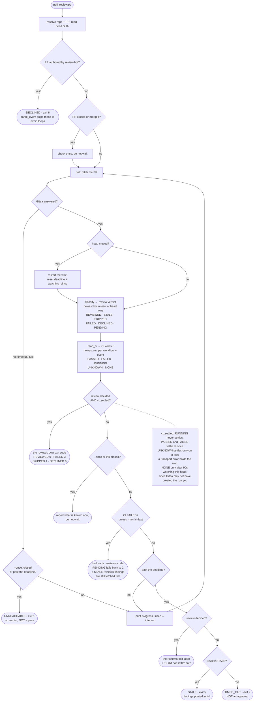

# babysit-pr

A Claude Code skill. Waits for `review-bot` (the `gitea-review-agent` companion
project) to finish reviewing a PR on your Gitea instance **and** for that PR's
CI to reach a final state, reports what each found, and stops.

It exists because the bot cannot block a merge: `build_review_payload`
hardcodes `"event": "COMMENT"`, never `APPROVE` or `REQUEST_CHANGES`, so branch
protection has nothing to gate on. A review can take ~30 minutes and routinely
lands after a fast merge. This skill is the only thing that makes you wait.

`SKILL.md` is the real documentation: the verdict tables, the rules, and the
reply/resolve contract all live there. `HISTORY.md` has the incidents behind
each rule.

## The flow

The review and CI are two independent verdicts. One loop polls both, and
neither waits on the other. The loop returns only when **both** have settled,
or when one of the escape hatches below fires first.



Four things this shape depends on:

- **Exit codes come from the review side only.** CI gets its own block and is
  never folded into the code. `PASSED` CI next to a `FAILED` review is still
  exit 3, so read both blocks, not the number.
- **`TIMED_OUT` is the last branch, not the default.** The decline paths now
  report as `DECLINED` with a reason, and a Gitea outage reports as
  `UNREACHABLE`. Reaching `TIMED_OUT` means none of them applied.
- **"Could not look" is never "nothing there".** An unreadable Actions API is
  `UNKNOWN`, not `NONE`. A Gitea that stays down is `UNREACHABLE`, not
  `TIMED_OUT`.
- **The CI fail-fast escape returns the *review's* code.** So an undecided
  review bails with exit 2, the same code as `TIMED_OUT`, which means
  something else entirely. That is why it prints an explicit banner.

## This repo *is* the installed skill

It is `git init`-ed in place at `~/.claude/skills/babysit-pr`, so there is no
copy step and no symlink: edit, test, commit, push. What you run is what is
committed.

Cloning it somewhere else gives you the files but not a working skill — Claude
Code discovers skills by directory location. To install on another machine,
clone to `~/.claude/skills/babysit-pr`.

## Usage

```bash
python3 ~/.claude/skills/babysit-pr/scripts/poll_review.py
```

Repo and PR are inferred from the current checkout's Gitea remote (set
`GITEA_BASE_URL` to match your instance) and branch; override with `--repo
owner/name --pr N`. Needs a Gitea token from `$GITEA_TOKEN`, or from the `tea`
login whose url matches `GITEA_BASE_URL`. No credentials are stored here.

## Tests

Plain Python, no pytest, so they run anywhere the skill runs. A failing check
is reported without stopping the run. `main()` runs end to end against a fake
Gitea and a fake clock. Required after any change:

```bash
cd scripts && python3 test_poll_review.py && python3 test_reply_finding.py
```
